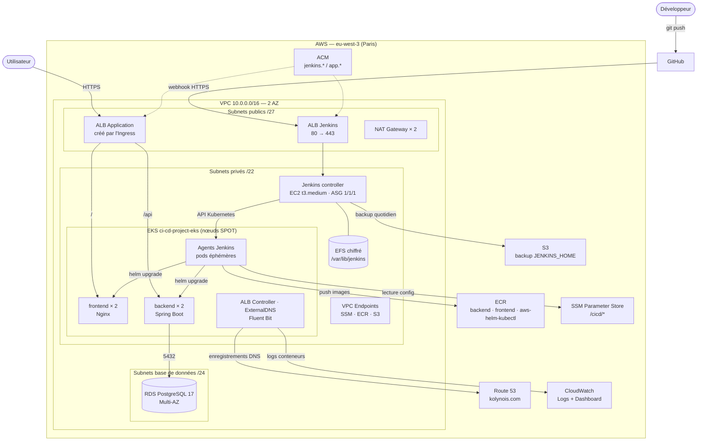
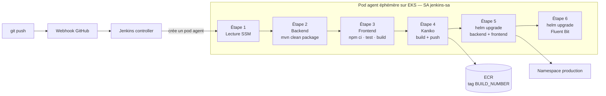
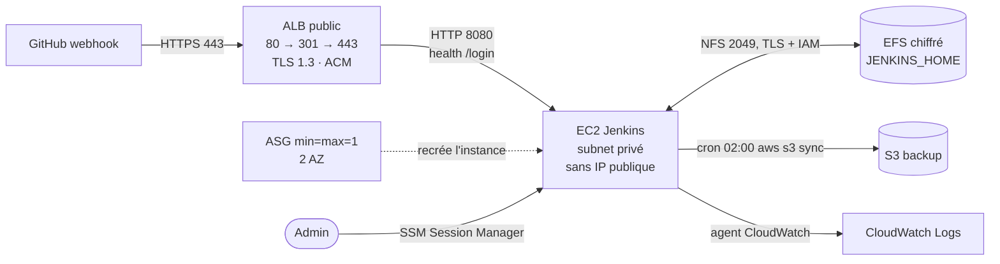

# BMI Health Dashboard — Déploiement cloud-native sur AWS EKS


Application de calcul et de suivi de l'IMC (API **Spring Boot**, SPA **React**, **PostgreSQL**) déployée sur **AWS** avec :

- une infrastructure entièrement décrite en **Terraform** ;
- une pipeline **Jenkins** dont les agents sont des **pods éphémères sur EKS** ;
- une exposition HTTPS automatisée (**ALB Controller**, **ExternalDNS**, **ACM**) et des logs centralisés dans **CloudWatch**.

| Service | URL |
|---|---|
| Application | `https://app.kolynois.com` |
| Jenkins | `https://jenkins.kolynois.com` |

## Sommaire

1. [Architecture AWS](#1-architecture-aws)
2. [Architecture CI/CD](#2-architecture-cicd)
3. [Lancer la pipeline](#3-lancer-la-pipeline)
4. [Points forts de l'architecture et réalisation](#4-points-forts-de-larchitecture-et-réalisation)

---

## 1. Architecture AWS



| Composant | Réalisation Terraform | Rôle |
|---|---|---|
| **Réseau** | `modules/networking` (module `terraform-aws-modules/vpc`) | VPC sur 2 AZ, 3 niveaux de subnets, 1 NAT Gateway par AZ |
| **Kubernetes** | `modules/eks` (module `terraform-aws-modules/eks` v20) | Cluster EKS 1.35, OIDC/IRSA, node group SPOT `t3.medium`/`t3.large` (1 → 5 nœuds) |
| **Base de données** | `modules/database` | RDS PostgreSQL 17 Multi-AZ, privé, `gp3` |
| **Registre** | `modules/registry` | Dépôts ECR backend et frontend avec scan à chaque push |
| **CI/CD** | `modules/jenkins_controller` | Jenkins sur EC2 (ASG), ALB HTTPS, EFS, bucket S3 de sauvegarde |
| **Endpoints privés** | `modules/endpoints` | Endpoints VPC S3 (Gateway), SSM, SSMMessages, EC2Messages, ECR API, ECR DKR |
| **DNS & TLS** | `acm-certificates.tf`, `main.tf` | Certificats ACM validés par DNS, alias Route 53 de Jenkins |
| **Add-ons EKS** | `alb_controller.tf`, `external_dns.tf`, `fluentbit.tf` | AWS Load Balancer Controller et ExternalDNS (Helm) ; rôle IRSA de Fluent Bit |
| **Accès CI/CD** | `jenkins_irsa.tf`, `ssm.tf`, `main.tf` | Rôles et access entries EKS, paramètres SSM partagés avec la pipeline |

**Plan d'adressage (VLSM)** — VPC `10.0.0.0/16` :

| Niveau | eu-west-3a | eu-west-3b | Hébergé |
|---|---|---|---|
| Public `/27` | `10.0.0.0/27` | `10.0.0.32/27` | ALB, NAT Gateways |
| Privé `/22` | `10.0.4.0/22` | `10.0.8.0/22` | Nœuds et pods EKS, Jenkins, EFS, endpoints |
| Base de données `/24` | `10.0.12.0/24` | `10.0.13.0/24` | RDS |

---

## 2. Architecture CI/CD



Le contrôleur Jenkins orchestre sans rien compiler. Pour chaque build, le plugin **Kubernetes** crée sur EKS un pod agent composé de quatre conteneurs, qui partagent le même espace de travail :

| Conteneur | Image | Usage |
|---|---|---|
| `maven` | `maven:3.8.5-eclipse-temurin-17` | Tests et packaging du backend |
| `node` | `node:22-alpine` | Tests et build du frontend |
| `kaniko` | `gcr.io/kaniko-project/executor:debug` | Construction et push des images |
| `aws-helm` | `aws-helm-kubectl` (ECR, construite depuis le `dockerfile` racine) | AWS CLI, kubectl, Helm |

| # | Stage | Actions |
|---|---|---|
| 1 | **Fetch Infra State (SSM)** | Lit les URL ECR, l'endpoint et le mot de passe RDS, l'ARN du certificat applicatif |
| 2 | **Backend: Test & Compile** | `mvn clean package` : 53 tests JUnit (H2 en mémoire), rapports publiés dans Jenkins |
| 3 | **Frontend: Test & Compile** | `npm ci`, `npm test` (19 tests Vitest), `npm run build` |
| 4 | **Build & Push to ECR (Kaniko)** | Images backend et frontend taguées `${BUILD_NUMBER}` |
| 5 | **Deploy via Helm** | `helm upgrade --install` des releases backend et frontend dans le namespace `production` |
| 6 | **Install FluentBit (Logging)** | `helm upgrade --install aws-for-fluent-bit` dans `kube-system` |

Un échec de test arrête la pipeline avant la construction des images : seule une version testée est déployée.

---

## 3. Lancer la pipeline

### Prérequis

- AWS CLI v2 configurée, **Terraform ≥ 1.0**, **kubectl**, **Helm 3**, **Docker**, plugin **Session Manager**.
- Un domaine avec une **zone hébergée Route 53** (ici `kolynois.com`).

Les noms de domaine (`kolynois.com`) et l'ID de compte AWS de l'environnement de référence figurent dans `aws-infra/`, `helm/helm-charts/` et le `Jenkinsfile` : remplacez-les pour un autre compte ou domaine.

### Étape 1 — Provisionner l'infrastructure

```bash
cd aws-infra
cat > terraform.tfvars <<'EOF'
db_password     = "un-mot-de-passe-robuste"
route53_zone_id = "Z0123456789ABCDEFGHIJ"
EOF

terraform init
terraform apply -target=module.networking -target=module.eks   # cluster d'abord (requis par le provider Helm)
terraform apply                                                # puis le reste
cd ..
```

### Étape 2 — Publier l'image outil de la pipeline

```bash
ACCOUNT_ID=$(aws sts get-caller-identity --query Account --output text)
REGISTRY=$ACCOUNT_ID.dkr.ecr.eu-west-3.amazonaws.com

aws ecr create-repository --repository-name aws-helm-kubectl --region eu-west-3
aws ecr get-login-password --region eu-west-3 | docker login --username AWS --password-stdin $REGISTRY
docker build -f dockerfile -t $REGISTRY/aws-helm-kubectl:latest .
docker push $REGISTRY/aws-helm-kubectl:latest
```

### Étape 3 — Créer le ServiceAccount des agents

```bash
aws eks update-kubeconfig --region eu-west-3 --name ci-cd-project-eks

helm upgrade --install ci-cd-init ./helm/helm-charts/ci-cd-init \
  --set jenkinsRoleArn=$(aws iam get-role --role-name ci-cd-project-jenkins-pod-role --query Role.Arn --output text)
```

### Étape 4 — Configurer Jenkins

1. Récupérer le mot de passe initial via **Session Manager** (aucun port SSH n'est ouvert) :

   ```bash
   ASG=$(terraform -chdir=aws-infra output -raw jenkins_asg_name)
   INSTANCE_ID=$(aws autoscaling describe-auto-scaling-groups --auto-scaling-group-names "$ASG" \
     --query 'AutoScalingGroups[0].Instances[0].InstanceId' --output text)
   aws ssm start-session --target "$INSTANCE_ID"
   sudo cat /var/lib/jenkins/secrets/initialAdminPassword
   ```

2. Sur `https://jenkins.kolynois.com`, installer les plugins suggérés et le plugin **Kubernetes**.
3. **Manage Jenkins → Clouds → Kubernetes** :
   - *Kubernetes URL* : `terraform -chdir=aws-infra output -raw eks_cluster_endpoint` ;
   - *Namespace* : **`kube-system`** (namespace du ServiceAccount `jenkins-sa`) ;
   - *Jenkins URL* : `https://jenkins.kolynois.com`, option **WebSocket** activée.
4. **New Item → Pipeline** : *Pipeline script from SCM*, dépôt GitHub, branche `main`, script `Jenkinsfile`, option **GitHub hook trigger for GITScm polling**.
5. Sur GitHub, **Settings → Webhooks** : `https://jenkins.kolynois.com/github-webhook/`, type `application/json`, événement *push*.

### Étape 5 — Déclencher et vérifier

Un `git push` sur `main` déclenche la pipeline (ou **Build Now** dans Jenkins). Ensuite :

```bash
kubectl get pods,ingress -n production
helm list -A
```

Quelques minutes plus tard, ExternalDNS publie `app.kolynois.com` et l'application est accessible en HTTPS.

---

## 4. Points forts de l'architecture et réalisation

### 4.1 Haute disponibilité sur deux zones

Le réseau, le cluster et la base sont répartis sur `eu-west-3a` et `eu-west-3b`. Chaque zone dispose de sa propre NAT Gateway, et la base bascule automatiquement sur son instance de secours.

```hcl
# modules/networking/main.tf
azs                    = ["${var.aws_region}a", "${var.aws_region}b"]
enable_nat_gateway     = true
single_nat_gateway     = false
one_nat_gateway_per_az = true

# modules/database/main.tf
multi_az = true   # instance de secours synchrone dans l'autre AZ
```

Le frontend et le backend tournent chacun avec **2 réplicas** (charts Helm).

### 4.2 Jenkins auto-réparé, sans perte d'état



**Réalisation** (`modules/jenkins_controller`) :

- un **Auto Scaling Group** `min = max = desired = 1` réparti sur les deux subnets privés relance automatiquement le contrôleur dans l'autre AZ en cas de panne ;
- `JENKINS_HOME` est stocké sur **EFS** chiffré, monté en TLS avec authentification IAM : la nouvelle instance retrouve jobs, plugins et configuration ;
- un **user-data** immuable installe Java 21, Jenkins, kubectl et AWS CLI, monte l'EFS, restaure depuis S3 si le volume est vide, génère le kubeconfig et programme la sauvegarde :

```bash
# jenkins-userdata.sh.tpl
echo "${efs_id}:/ /var/lib/jenkins efs _netdev,tls,iam 0 0" >> /etc/fstab
0 2 * * * root aws s3 sync /var/lib/jenkins "s3://${s3_bucket}/jenkins_home" --delete
```

### 4.3 Agents de build éphémères sur EKS

Les builds ne s'exécutent pas sur le contrôleur : chaque exécution reçoit un pod neuf, isolé et détruit à la fin. Les pods tournent sur un node group **SPOT** (2 nœuds, dimensionnable de 1 à 5), avec deux types d'instances pour augmenter les chances d'obtenir de la capacité Spot.

```groovy
// Jenkinsfile
agent {
    kubernetes {
        yaml '''
spec:
  serviceAccountName: jenkins-sa
  containers:
  - name: maven      # image maven:3.8.5-eclipse-temurin-17
  - name: node       # image node:22-alpine
  - name: kaniko     # image gcr.io/kaniko-project/executor:debug
  - name: aws-helm   # image ECR aws-helm-kubectl
'''
    }
}
```

### 4.4 Aucune clé AWS statique : IRSA et profils d'instance

Chaque composant obtient des identifiants temporaires liés à son identité, avec ses propres permissions :

| Identité | Mécanisme | Permissions |
|---|---|---|
| Contrôleur Jenkins | Profil d'instance EC2 | SSM Session Manager, bucket de sauvegarde, EFS, CloudWatch Logs, `eks:DescribeCluster` |
| Pods agents (`kube-system:jenkins-sa`) | IRSA | ECR (pull/push), `ssm:GetParameter`, EKS |
| `aws-load-balancer-controller` | IRSA | Gestion des ALB |
| `external-dns` | IRSA | Route 53 |
| `fluent-bit` | IRSA | Écriture dans CloudWatch Logs |

```hcl
# jenkins_irsa.tf
module "jenkins_pod_irsa" {
  source = "terraform-aws-modules/iam/aws//modules/iam-role-for-service-accounts-eks"
  oidc_providers = {
    main = {
      provider_arn               = module.eks.oidc_provider_arn
      namespace_service_accounts = ["kube-system:jenkins-sa"]
    }
  }
}
```

L'accès au cluster passe par les **EKS access entries** (`aws_eks_access_entry`), sans modifier le ConfigMap `aws-auth`.

### 4.5 Terraform et Jenkins découplés par SSM Parameter Store

Terraform publie les sorties de l'infrastructure dans SSM ; la pipeline les relit à chaque exécution. Le Jenkinsfile ne contient aucune URL de registre, aucun endpoint ni aucun mot de passe.

```hcl
# ssm.tf
resource "aws_ssm_parameter" "rds_password" {
  name  = "/cicd/rds/password"
  type  = "SecureString"
  value = var.db_password
}
```

```groovy
// Jenkinsfile — stage "Fetch Infra State (SSM)"
env.DB_PASSWORD = sh(script: "aws ssm get-parameter --name '/cicd/rds/password' --with-decryption --query 'Parameter.Value' --output text", returnStdout: true).trim()
```

Paramètres partagés : `/cicd/ecr/backend_url`, `/cicd/ecr/frontend_url`, `/cicd/rds/endpoint`, `/cicd/rds/password`, `/cicd/app/cert_arn`, `/cicd/jenkins/cert_arn`, `/cicd/fluentbit/role_arn`.

### 4.6 Images construites sans démon Docker (Kaniko)

Kaniko construit les images dans un conteneur standard, sans socket Docker ni mode privilégié. Le conteneur `aws-helm` génère les identifiants ECR dans un volume `emptyDir` partagé, que Kaniko utilise ensuite pour pousser :

```bash
# Conteneur aws-helm : identifiants ECR écrits dans le volume partagé
PASSWORD=$(aws ecr get-login-password --region eu-west-3)
echo "{\"auths\":{\"${REGISTRY_URL}\":{\"username\":\"AWS\",\"password\":\"${PASSWORD}\"}}}" > /kaniko/.docker/config.json

# Conteneur kaniko : build et push
/kaniko/executor --context "$(pwd)" --dockerfile "$(pwd)/Dockerfile" --destination "${ECR_BACKEND}:${IMAGE_TAG}"
```

Chaque image est taguée avec le numéro de build : toute version déployée est traçable jusqu'à son exécution Jenkins, et ECR la scanne à chaque push.

### 4.7 Exposition HTTPS entièrement automatisée

Aucune action manuelle dans la console : un simple `helm upgrade` crée l'ALB, branche le certificat et publie le DNS.

1. **ACM** — les certificats sont validés automatiquement par des enregistrements Route 53 créés par Terraform (`acm-certificates.tf`).
2. **AWS Load Balancer Controller** — transforme l'Ingress en ALB, avec un trafic envoyé directement aux IP des pods (`target-type: ip`).
3. **ExternalDNS** — crée l'enregistrement `app.kolynois.com` vers l'ALB (`policy: sync`).
4. **Un seul domaine** pour le frontend et l'API : l'Ingress route `/api` vers le backend et `/` vers Nginx.

```yaml
# helm/helm-charts/frontend — Ingress
annotations:
  alb.ingress.kubernetes.io/scheme: internet-facing
  alb.ingress.kubernetes.io/target-type: ip
  alb.ingress.kubernetes.io/listen-ports: '[{"HTTPS":443}]'
  alb.ingress.kubernetes.io/certificate-arn: <injecté depuis SSM par la pipeline>
  external-dns.alpha.kubernetes.io/hostname: app.kolynois.com
rules:
  - path: /api → backend-service:80
  - path: /    → frontend:80
```

### 4.8 Sécurité réseau en couches

- **Trois niveaux de subnets** (VLSM) : seuls les ALB et les NAT sont publics ; les `/22` privés absorbent les IP des pods (CNI VPC) ; les `/24` base de données n'ont aucune route vers Internet.
- **Chaînage de Security Groups** plutôt que de plages IP :

```hcl
# RDS : PostgreSQL accessible uniquement depuis les nœuds EKS
security_groups = [var.eks_nodes_sg_id]
# Jenkins : port 8080 accessible uniquement depuis son ALB
security_groups = [aws_security_group.alb_sg.id]
# EFS : NFS accessible uniquement depuis Jenkins
security_groups = [aws_security_group.jenkins.id]
```

- **Pas d'IP publique** pour Jenkins, les nœuds EKS et RDS ; administration via **SSM Session Manager**, sans bastion ni SSH.
- **Endpoints VPC** (SSM, ECR, S3) : ces flux restent sur le réseau AWS.
- **HTTPS** pour tous les accès publics : certificats ACM sur les deux ALB, politique `ELBSecurityPolicy-TLS13-1-2-2021-06` et redirection 80 → 443 pour Jenkins.

### 4.9 Observabilité centralisée

| Source | Collecte | Destination |
|---|---|---|
| Conteneurs EKS | **Fluent Bit** (DaemonSet, IRSA) installé par la pipeline | `/eks/ci-cd-project-eks/applications` |
| Contrôleur Jenkins | Agent **CloudWatch** installé par le user-data | `/jenkins/controller` |
| Bootstrap EC2 | Agent CloudWatch | `/jenkins/bootstrap` |
| Infrastructure | Terraform `aws_cloudwatch_dashboard` | Dashboard `ci-cd-project-overview` |
| Tests | Plugin JUnit | Rapports dans Jenkins |

---

## Auteur

**Kolynois** — projet de développement et de déploiement cloud-native sur AWS (Spring Boot · React · Terraform · EKS · Jenkins · Helm).
